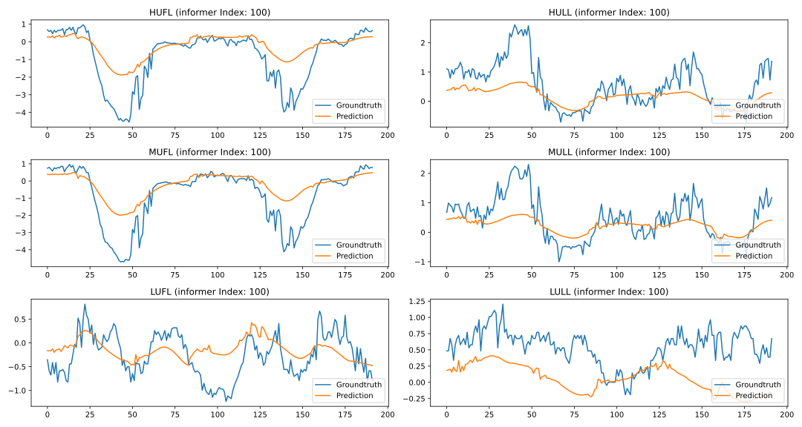
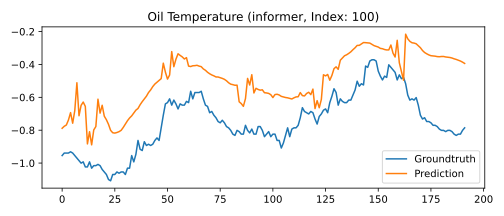
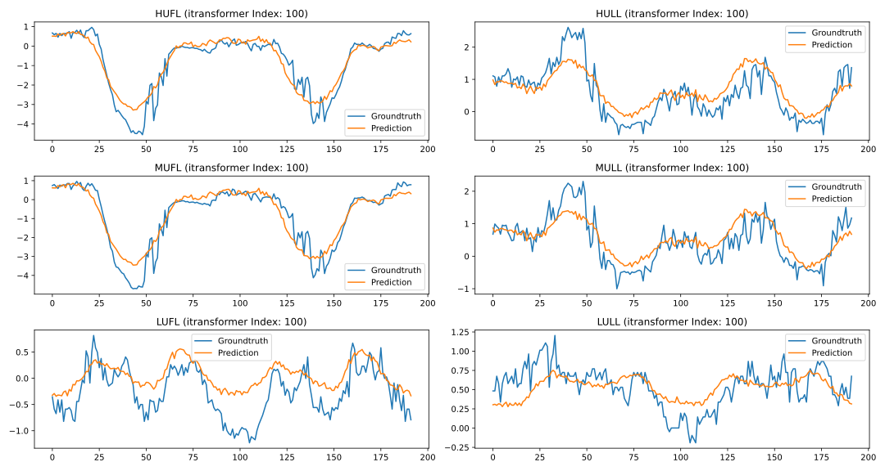
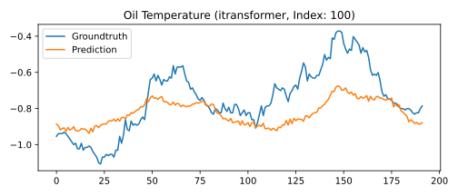

# Time Series Forcasting
This code utilizes two transformer-based model for the long sequence time series data forcasting tasks:
- Informer: *"Informer: Beyond Efficient Transformer for Long Sequence Time-Series Forecasting"* (AAAI-2021 Best Paper)
- iTransformer: *"iTransformer: Inverted Transformers Are Effective for Time Series Forecasting"* (ICLR-2024)

## Requirements
- ubuntu-22.04
- python-3.8.19
- cuda-11.8
- pytorch==2.0.1
- matplotlib
- tqdm
- dtaidistance
- pandas
- scikit_learn

```bash
# install pytorch (this can be decided by the user)
pip install torch==2.0.1 torchvision==0.15.2 torchaudio==2.0.2 --index-url https://download.pytorch.org/whl/cu118
# install other packages
pip install matplotlib
pip install pandas
pip install scikit_learn
pip install tqdm
pip install dtaidistance

# or use conda
conda env create -f environment.yml
```

## Instruction
1. Download the Electricity Transformer Dataset (ETT) and place in `data/ETT/ETT*.csv`.
2. Run **Informer** experiments as follows or you can run `bash run_informer.sh` to run all experiments:
```bash
python train.py --model informer --features M --seq_len 96 --label_len 96 --pred_len 336 --e_layers 2 --d_layers 1 --attn prob --dataset_path data/ETT/ETTh1.csv
```
3. Run **iTransformer** experiments as follows or you can run `bash run_itransformer.sh` to run all experiments:
```bash
python train.py --features M  --seq_len 96 --pred_len 96 --e_layers 2 --d_model 256 --d_ff 256 --model itransformer --train_epoch 10 --dataset_path data/ETT/ETTh1.csv
```
4. Use `visualization.py` for visualize the results:
```bash
python visualization.py --results_path <path-to-save-npy>
```

## Results
All trained checkpoints and visualization plots are saved in [Google Drive]().

## Visualization
### Informer


### Informer

